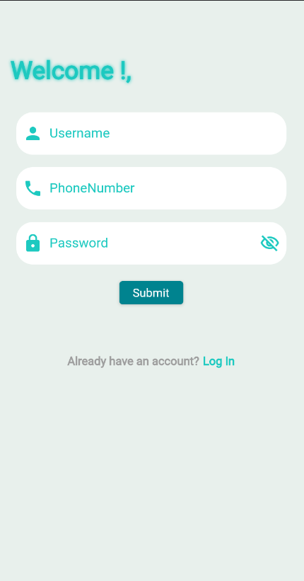
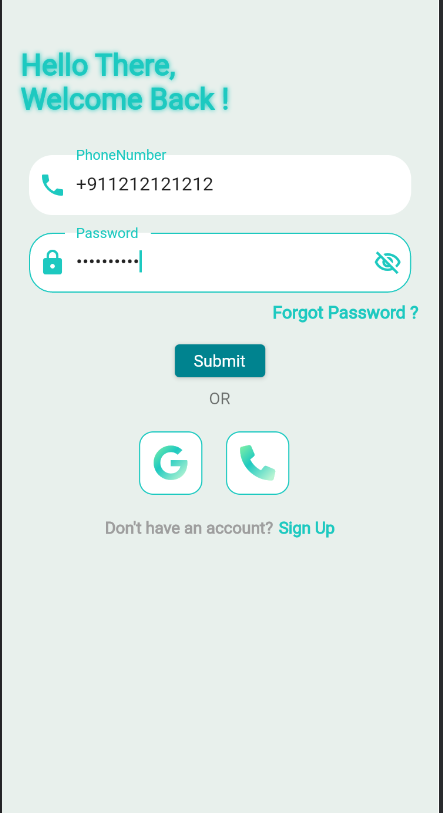
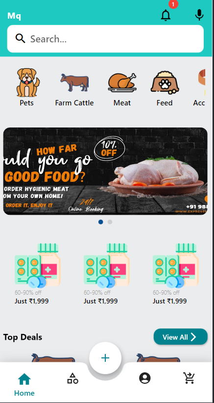
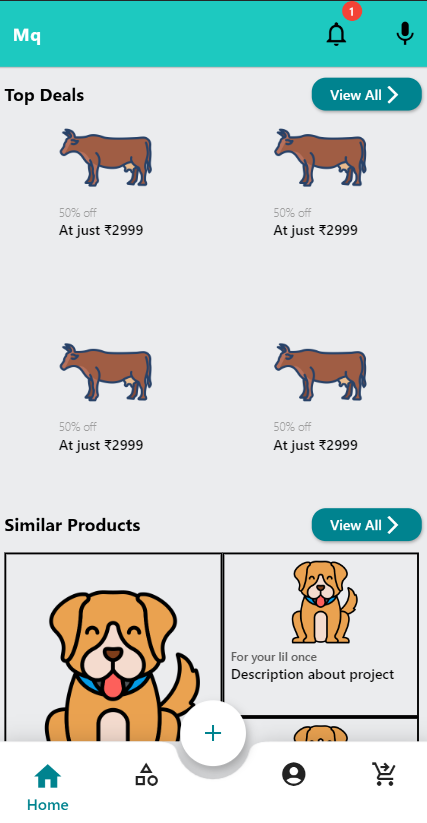
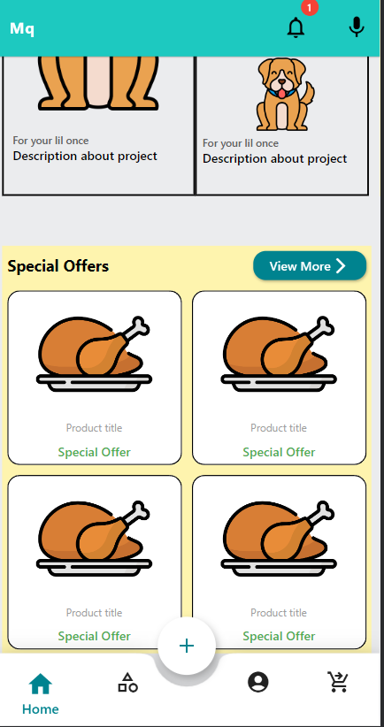
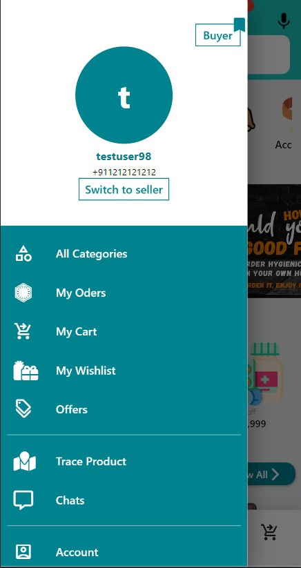
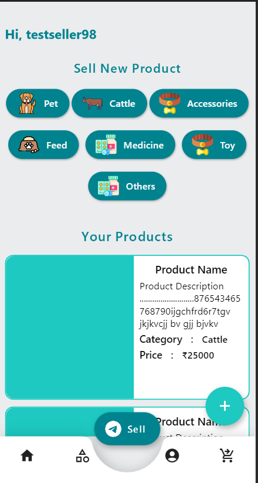
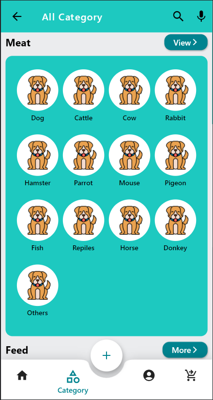
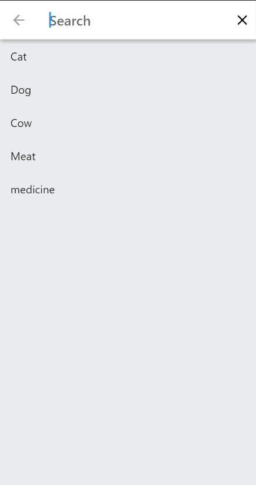
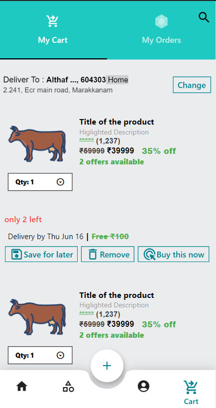

# Meat Livestock Client App

## Description
The Meat Livestock Client App is a Flutter application designed for users to browse and purchase meat and livestock products. The application follows the MVCV (Model-View-Controller-ViewModel) architecture to ensure a clean separation of concerns and maintainability.

## Features
- User authentication with Firebase Auth and JWT for persistent authentication.
- Integration with a Node.js backend for managing products, orders, and user information.
- Real-time updates and notifications using Firebase Cloud Messaging.
- Secure data transactions with HTTPS and JWT.

## Technologies Used
- Flutter
- Firebase Auth
- JWT
- Node.js (Backend)
- MVCV Architecture

## Installation Instructions

1. **Clone the repository**:
   ```sh
   git clone https://github.com/Althaf-codes/Meat_livestock_client-app
   cd Meat_livestock_client-app

2. Install Flutter dependencies:
   ```sh
   flutter pub get

3. Set up Firebase:
   Follow the instructions from Firebase docs to add Firebase to your Flutter app:

4. Run the app:
   ```sh
   flutter run
     
## Screenshots/Demos
   
   
   
   
   
   
   
   
   
   
   

## Created Date
This project was created on January 6, 2022.


